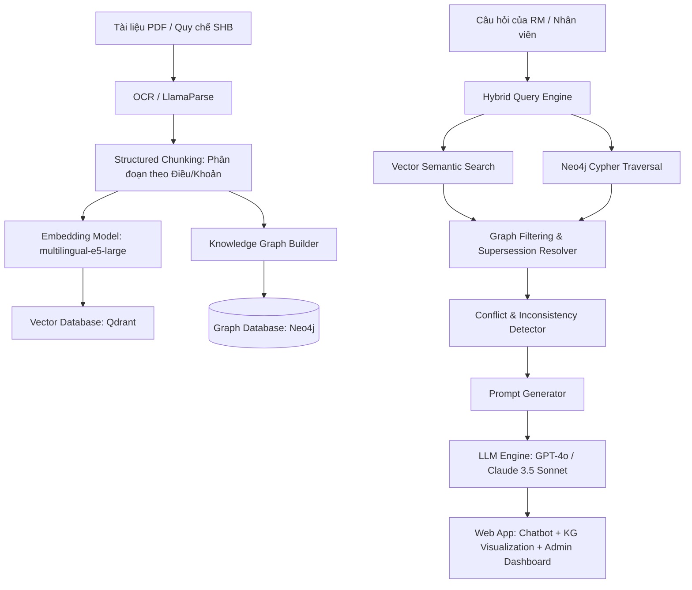

# KẾ HOẠCH HÀNH ĐỘNG DỰ ÁN: SHB ADVANCED GRAPH-RAG CHATBOT (MASTER PLAN)

Tài liệu này tổng hợp toàn bộ chiến lược, kiến trúc kỹ thuật và lộ trình thực thi chi tiết cho giải pháp **Advanced RAG Knowledge Base – AI Chatbot for Complex Banking Document Retrieval** (Đặt đề bài bởi Ngân hàng SHB tại VAIC 2026).

---

## 1. TỔNG QUAN BÀI TOÁN & THỬ THÁCH THỰC TẾ

### 1.1. Vấn đề của SHB
Ngân hàng SHB quản lý hàng ngàn văn bản pháp quy nội bộ và bên ngoài (Thông tư Ngân hàng Nhà nước, Nghị định Chính phủ, quy chế nội bộ, biểu mẫu...). 
* **Hạn chế**: Văn bản liên tục bị sửa đổi, bổ sung và hết hiệu lực một phần qua nhiều thời kỳ.
* **Hạn chế của RAG truyền thống**: Tìm kiếm tương đồng ngữ nghĩa bằng Vector search đơn thuần dễ trả về các điều khoản cũ, hết hiệu lực, gây rủi ro tuân thủ pháp lý cực kỳ nghiêm trọng.

### 1.2. Bốn mục tiêu nghiệp vụ bắt buộc phải xử lý
1. **Cross-references (Dẫn chiếu chéo)**: Tự động tổng hợp thông tin khi văn bản này dẫn chiếu đến điều khoản ở văn bản khác.
2. **Amendments (Quy định sửa đổi)**: Nhận diện và trả về nội dung theo phiên bản sửa đổi mới nhất đang có hiệu lực.
3. **Partial supersession (Hết hiệu lực một phần)**: Đánh dấu và loại bỏ các điều khoản/điều luật đã bị bãi bỏ ra khỏi câu trả lời của AI.
4. **Conflicting regulations (Xung đột pháp quy)**: Tự động đối chiếu quy định nội bộ và văn bản pháp lý bên ngoài để phát hiện mâu thuẫn và đưa ra cảnh báo cho người dùng.

---

## 2. KIẾN TRÚC KỸ THUẬT HỆ THỐNG (ARCHITECTURAL BLUEPRINT)

Để mô hình hóa chính xác các mối quan hệ phức tạp giữa các văn bản pháp quy, giải pháp sử dụng kiến trúc **Graph-RAG** kết hợp giữa **Vector Database** (Qdrant) và **Graph Database** (Neo4j).

### 2.1. Đồ thị tri thức (Knowledge Graph Schema)
* **Các Node**:
  * `Document`: Thông tin văn bản (id, tên, ngày ban hành, loại văn bản).
  * `Clause`: Đoạn nội dung Điều/Khoản cụ thể (id, tiêu đề, văn bản, trạng thái hiệu lực, ngày có hiệu lực).
* **Các mối quan hệ (Edges)**:
  * `(Document)-[:HAS_CLAUSE]->(Clause)`: Chứa điều khoản.
  * `(Clause)-[:REFERENCES]->(Clause)`: Tham chiếu chéo (Cross-references).
  * `(Clause)-[:SUPERSEDES {scope: "partial" / "full"}]->(Clause)`: Điều khoản thay thế/bãi bỏ (Supersession).
  * `(Document)-[:AMENDS]->(Document)`: Sửa đổi bổ sung văn bản (Amendments).

---

## 3. QUY TRÌNH XỬ LÝ (DATA FLOW PIPELINE)

### 3.1. Ingestion Pipeline (Nạp văn bản)
1. **Phân tách cấu trúc**: Dùng thư viện OCR hoặc LlamaParse đọc văn bản, chuyển về định dạng cấu trúc, nhận diện chính xác các thẻ Điều/Khoản/Điểm.
2. **Tạo Vector Embedding**: Dùng `multilingual-e5-large` để sinh vector cho từng Clause chunk, đẩy vào Qdrant.
3. **Xây dựng đồ thị liên kết**: Sử dụng LLM để trích xuất metadata và tạo quan hệ tự động:
   * Trích xuất ngày hiệu lực.
   * Phát hiện các liên kết dẫn chiếu chéo để tạo quan hệ `REFERENCES`.
   * Phát hiện các câu lệnh thay thế/bãi bỏ điều khoản cũ để tạo quan hệ `SUPERSEDES` và cập nhật thuộc tính `status` của điều khoản cũ thành `Superseded`.

### 3.2. Query Pipeline (Tìm kiếm & Sinh câu trả lời)
1. **Bước 1: Retrieval (Truy xuất kép)**:
   * Dùng Vector Search tìm Top 10 chunks có ngữ nghĩa gần nhất.
   * Dùng Cypher Query duyệt đồ thị Neo4j để lấy các điều khoản liên quan qua quan hệ `REFERENCES` và `SUPERSEDES`.
2. **Bước 2: Resolving & Filtering (Lọc trạng thái)**:
   * Hệ thống duyệt đồ thị: Nếu một chunk được tìm thấy nhưng bị liên kết bởi cạnh `SUPERSEDES` đến một node mới hơn ở trạng thái `Active`, hệ thống sẽ **loại bỏ hoàn toàn chunk cũ** khỏi bộ nhớ context gửi đi.
3. **Bước 3: Conflict Detection (Phát hiện xung đột)**:
   * Module đối chiếu dữ liệu sẽ kiểm tra hiệu lực văn bản: Nếu phát hiện quy trình nội bộ của SHB dẫn chiếu đến một thông tư cũ của NHNN đã bị thông tư mới phủ quyết, hệ thống lập tức trích xuất cặp mâu thuẫn này để đưa vào panel cảnh báo.
4. **Bước 4: Sinh câu trả lời**:
   * LLM tổng hợp thông tin từ nguồn dữ liệu sạch đã được lọc, định dạng câu trả lời kèm **trích dẫn cụ thể (Citations)** trỏ về các điều khoản gốc.

---

## 4. CHI TIẾT CÔNG NGHỆ (TECHNOLOGY STACK)

| Tầng công nghệ | Công nghệ lựa chọn | Lý do lựa chọn |
| :--- | :--- | :--- |
| **Frontend** | **React.js / Streamlit** | React cho phép xây dựng UI/UX tùy biến cao, mượt mà; Streamlit dùng để làm nhanh prototype thử nghiệm. |
| **Backend API** | **FastAPI (Python)** | Xử lý bất đồng bộ (async), tốc độ cực nhanh, hỗ trợ đầy đủ các thư viện AI và DB. |
| **Vector DB** | **Qdrant / Milvus** | Tìm kiếm vector tương đồng ngữ nghĩa tốc độ cao, hỗ trợ lọc metadata linh hoạt. |
| **Graph DB** | **Neo4j** | Đồ thị tri thức mạnh mẽ nhất, hỗ trợ Cypher Query tối ưu để duyệt liên kết. |
| **Embedding** | **multilingual-e5-large** | Hiểu sâu ngữ nghĩa tiếng Việt chuyên ngành Tài chính - Ngân hàng. |
| **Orchestrator**| **LlamaIndex / LangChain** | Hỗ trợ mô hình Graph RAG tích hợp sẵn, dễ dàng đồng bộ Vector và Graph Store. |
| **Core LLM** | **GPT-4o / Claude 3.5 Sonnet** | Khả năng suy luận logic xuất sắc để phát hiện mâu thuẫn và soạn thảo trích dẫn. |

---

## 5. THIẾT KẾ GIAO DIỆN (UI/UX DESIGN)

Web App sẽ bao gồm các phân hệ chính:
1. **AI Chatbot Portal**:
   * Khung chat ngôn ngữ tự nhiên tiếng Việt, hỗ trợ gõ không dấu.
   * **Clickable Citations**: Các tag trích dẫn nguồn ở cuối câu trả lời, click vào sẽ bung ra popup xem văn bản gốc.
   * **Inconsistency Warning**: Banner màu vàng hiển thị các quy định mâu thuẫn nếu hệ thống phát hiện xung đột.
2. **Knowledge Graph Explorer**:
   * Sơ đồ mạng lưới đồ thị tri thức trực quan tương tác (sử dụng D3.js hoặc Pyvis), hiển thị các mối quan hệ `AMENDS`, `SUPERSEDES`, `REFERENCES` giữa các văn bản của SHB.
3. **Timeline điều khoản**:
   * Biểu đồ trục thời gian hiển thị lịch sử thay đổi của từng điều khoản qua các năm.
4. **Admin Dashboard**:
   * Giao diện tải văn bản PDF mới lên hệ thống, tự động phân tích và hiển thị đề xuất liên kết đồ thị trước khi lưu.

---

## 6. KẾ HOẠCH HÀNH ĐỘNG 48 GIỜ (TIMELINE)

### Giai đoạn 1: Thiết lập & Nạp dữ liệu (Giờ 0 - Giờ 12)
* Khởi tạo cơ sở dữ liệu Neo4j và Qdrant local/cloud.
* Viết script Python phân tách PDF (chunking theo điều khoản) và trích xuất siêu dữ liệu tự động bằng LLM.
* Đẩy bộ dữ liệu mẫu (Thông tư NHNN & Quy chế nội bộ SHB) vào Vector DB và dựng đồ thị tri thức trên Neo4j.

### Giai đoạn 2: Lập trình Backend RAG & Phát hiện xung đột (Giờ 12 - Giờ 24)
* Viết API Hybrid Search kết hợp Qdrant Vector Search và Neo4j Cypher Query.
* Cài đặt logic lọc điều khoản hết hạn (Supersession Resolver).
* Viết thuật toán đối chiếu dữ liệu để phát hiện mâu thuẫn (Conflict Detector).
* **Nộp Checkpoint 1 (11:00 Ngày thứ 2)**.

### Giai đoạn 3: Phát triển UI/UX & Tích hợp (Giờ 24 - Giờ 36)
* Xây dựng giao diện chat, sơ đồ trực quan hóa đồ thị tri thức và dashboard admin.
* Kết nối Frontend React/Streamlit với API Backend FastAPI.
* Deploy ứng dụng lên VPS/Cloud để lấy Live URL.
* **Nộp Checkpoint 2 (23:00 Ngày thứ 2)**.

### Giai đoạn 4: Tối ưu hóa, Kiểm thử & Đóng gói (Giờ 36 - Giờ 48)
* Đánh giá chất lượng (Benchmark) so với RAG truyền thống để vẽ biểu đồ chứng minh hiệu quả.
* Tối ưu hóa tốc độ phản hồi bằng cache hoặc model compilation (`torch.compile`).
* Chuẩn bị Slide thuyết trình (Pitch deck) và quay Video demo ($\le$ 5 phút).
* Đóng cổng nộp bài (11:00 Ngày thứ 3).

---

## 7. BẢN PHÂN CÔNG VAI TRÒ TRONG ĐỘI THI
* **Minh (Backend & RAG Architect)**: Cài đặt CSDL, xây dựng Hybrid Search Pipeline, lọc đồ thị và thuật toán phát hiện mâu thuẫn.
* **Duy (Frontend & Graph UI)**: Thiết kế giao diện chat, thiết kế trực quan hóa đồ thị tri thức bằng React và xử lý ngôn ngữ đầu vào.
* **Trung (Nghiệp vụ & Benchmark)**: Soạn dữ liệu test mẫu, viết tài liệu so sánh RAG truyền thống vs Graph-RAG để đưa vào slide thuyết trình.
* **Antigravity (AI Co-pilot)**: Viết code mẫu, kiểm tra logic, tối ưu hóa an toàn thông tin (NĐ 13) và chuẩn bị slide nộp bài.
