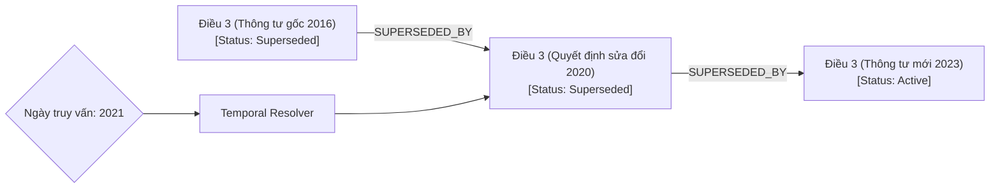

# KẾ HOẠCH HÀNH ĐỘNG DỰ ÁN: SHB ADVANCED GRAPH-RAG CHATBOT (VERSION 2 - ĐỘT PHÁ)

Tài liệu này nâng cấp bản kế hoạch hành động lên **Version 2**, tích hợp các nghiên cứu mới nhất về **Graph-RAG**, **Agentic RAG**, thuật toán đồ thị, logic thời gian và các mô hình học máy chuyên biệt để tạo ra một giải pháp đột phá, có chiều sâu kỹ thuật vượt trội nhằm giành các giải thưởng lớn (SHB, Meta PyTorch, FPT).

---

## 1. SO SÁNH NÂNG CẤP: VERSION 1 vs VERSION 2

| Tính năng / Kiến trúc | Version 1 (Cơ bản - Đủ dùng) | Version 2 (Đột phá - Chuyên sâu) |
| :--- | :--- | :--- |
| **PDF Parsing** | Đọc text PDF thông thường. | **Layout-Aware Parsing**: Phân tích cấu trúc bảng biểu, sơ đồ bằng Visual-LLM (ColPali/Florence-2) để giữ nguyên cấu trúc phân cấp (Hierarchy Tree). |
| **Retrieval Engine** | Hybrid Search (Vector + Cypher cơ bản) độc lập. | **Agentic Graph Routing**: Agent thông minh tự động lập lộ trình đi trên đồ thị (Graph Walk) để thu thập tài liệu dẫn chiếu. |
| **Xử lý Hết hiệu lực** | Đánh dấu thuộc tính `status` thủ công. | **Temporal Directed Acyclic Graph (Temporal DAG)**: Mô hình hóa các điều khoản thành một cây thời gian; tự động phân giải phiên bản dựa trên tham số ngày truy vấn. |
| **Phát hiện Xung đột** | LLM tự so sánh các đoạn text thô. | **Natural Language Inference (NLI) & Decomposed Contradiction Analysis**: Sử dụng mô hình NLI cục bộ để phát hiện mâu thuẫn logic điều khoản tự động. |
| **Mô hình phục vụ** | Gọi API đám mây (GPT/Claude). | **Local Fine-Tuned LLM (PyTorch FSDP2)**: Fine-tune mô hình Llama-3-8B/Qwen-7B chuyên biệt tiếng Việt ngân hàng, tối ưu hóa bằng `torch.compile`. |

---
## 2. CÁC THUẬT TOÁN CỐT LÕI & Ý TƯỞNG ĐỘT PHÁ (CORE ALGORITHMS)

### 2.1. Thuật toán 1: Temporal DAG Versioning Engine (Giải quyết triệt để Amendments & Supersession)
Thay vì lưu trữ tài liệu tĩnh, mỗi **Điều khoản (Clause)** được ánh xạ thành một nút trên Đồ thị Thời gian định hướng không chu trình (Temporal DAG).



* **Cách thức hoạt động**:
  * Khi nạp tài liệu mới có câu lệnh *"Bãi bỏ Khoản 1 Điều 5 của Thông tư X"* hoặc *"Sửa đổi bổ sung Điều 3 Thông tư Y"*, Graph Builder tự động tạo cạnh `[:SUPERSEDES {effective_date: "2026-07-17"}]` từ điều khoản mới trỏ về điều khoản cũ.
  * **Thuật toán Duyệt**: Khi người dùng đặt câu hỏi, hệ thống truyền kèm tham số ngày áp dụng `query_date` (mặc định là ngày hiện tại). Thuật toán Cypher sẽ đi dọc theo chuỗi quan hệ `SUPERSEDED_BY` và chọn phiên bản Clause có `effective_date` gần nhất nhưng nhỏ hơn hoặc bằng `query_date`. Các phiên bản nằm ngoài khoảng thời gian này hoặc đã bị bãi bỏ sẽ bị cắt nhánh hoàn toàn.

### 2.2. Thuật toán 2: Agentic Graph Walk & Self-Querying (Giải quyết Cross-references)
* **Ý tưởng**: Không sử dụng tìm kiếm hybrid tĩnh. Chúng ta xây dựng một **Graph Agent** chạy trên khung làm việc **ReAct** (Reasoning and Acting).
* **Lộ trình duyệt đồ thị (Graph Walk)**:
  * **Bước 1**: Agent nhận câu hỏi, gọi Vector Search tìm các node khởi đầu (Seed Nodes).
  * **Bước 2**: Từ các Seed Nodes, Agent kiểm tra các quan hệ `REFERENCES` (Tham chiếu). Nếu phát hiện một quy trình dẫn chiếu đến một quy chuẩn bảo mật khác, Agent sẽ phát lệnh duyệt đồ thị (Graph Walk) để truy xuất tiếp nội dung của node tham chiếu đó.
  * **Bước 3**: Agent tự động gom toàn bộ thông tin trên đường đi (path) để tổng hợp thành một ngữ cảnh liên mạch, đảm bảo không bỏ sót bất kỳ văn bản liên quan nào.

### 2.3. Thuật toán 3: Decomposed Contradiction Analysis bằng NLI (Giải quyết Conflicting Regulations)
* **Vấn đề**: LLM thường bị giới hạn về khả năng suy luận logic chính xác khi so sánh hàng trăm văn bản có cấu trúc phức tạp, dẫn đến bỏ sót xung đột quy chế.
* **Thuật toán DCA (Phân rã mâu thuẫn)**:
  1. Sử dụng LLM để phân rã mỗi Clause chunk thành một bộ ba thông tin logic (Triple): `[Chủ thể, Hành động, Ràng buộc]` (ví dụ: `[Khách hàng cá nhân, Hạn mức vay tín chấp, Tối đa 100 triệu]`).
  2. Khi có tài liệu mới, hệ thống tìm các Clause node có cùng `Chủ thể` và `Hành động`.
  3. Sử dụng mô hình **NLI (Natural Language Inference)** cục bộ (ví dụ: `DeBERTa-v3-large-task-contradiction` được tối ưu hóa) để chấm điểm mâu thuẫn giữa các cặp `Ràng buộc` của các điều khoản cùng hiệu lực.
  4. Nếu điểm mâu thuẫn (Contradiction score) $> 0.85$, hệ thống tự động tạo cạnh `[:CONFLICTS_WITH]` trên Neo4j và gắn nhãn cảnh báo lên Dashboard giám sát tuân thủ của ngân hàng.

---

## 3. THIẾT KẾ KIẾN TRÚC GRAPH-RAG CHUYÊN SÂU (ADVANCED PIPELINE)

```
                            [ USER QUERY ]
                                  |
                                  v
                       [ Query Parser / Reformulator ]
                                  |
                                  v
                    [ Agentic Router: Vector vs Graph ]
                       /                         \
                      v                           v
             [ Vector Search ]             [ Cypher Query Generator ]
             (Top K Semantic Chunks)       (Dynamic Graph Walk)
                      \                           /
                       v                         v
                   [ Temporal Resolver (DAG Filter) ]
                                  |
                                  v
              [ NLI Contradiction Engine (Conflict Detect) ]
                                  |
                                  v
                    [ Faithfulness / Grounding Validator ]
                                  |
                                  v
                           [ LLM Generator ]
                                  |
                                  v
                       [ Cited Answer Output ]
```

---

## 4. CHI TIẾT CƠ CẤU PHÁT TRIỂN & TỐI ƯU HÓA CÔNG NGHỆ

### 4.1. Tối ưu hóa hiệu năng PyTorch (Giành giải Meta PyTorch Award)
Để chứng minh năng lực kỹ thuật vượt trội với Meta:
* **Memory Optimization**: Áp dụng **`nn.LinearCrossEntropyLoss`** trong quá trình fine-tune LLM cục bộ (Llama-3-8B) trên dữ liệu ngân hàng để giảm dung lượng RAM đỉnh (Peak memory) lên đến 4 lần.
* **Inference Speedup**: Xuất mô hình sang định dạng C++ binary sử dụng **AOTInductor** kết hợp `torch.compile` giúp giảm độ trễ (latency) của Agent xuống mức sub-second (dưới 1 giây cho mỗi token đầu tiên).
* **ExecuTorch Engine**: Triển khai mô hình nén INT4 chạy offline trên thiết bị di động của các kiểm soát viên SHB để tra cứu nhanh khi kiểm tra thực địa, đáp ứng tuyệt đối tiêu chuẩn bảo mật dữ liệu của ngân hàng.

### 4.2. Hệ thống Đánh giá Benchmark tự động (RAG Triad Evaluation)
Thiết lập bộ đánh giá tự động dựa trên 3 tiêu chí cốt lõi (RAG Triad):
1. **Context Relevance**: Độ liên quan của ngữ cảnh được truy xuất (Vector + Graph) so với câu hỏi.
2. **Groundedness (Faithfulness)**: Câu trả lời của Agent có hoàn toàn dựa trên tài liệu được truy xuất hay không (chống bịa đặt thông tin).
3. **Answer Relevance**: Câu trả lời có giải quyết đúng trọng tâm câu hỏi của người dùng hay không.
* *Cách thực hiện*: Sử dụng thư viện **TruLens** hoặc **Ragas** để chạy benchmark tự động và vẽ biểu đồ so sánh giữa RAG thường (độ chính xác chỉ khoảng 60-70%) với Advanced Graph-RAG của chúng ta (độ chính xác đạt $\ge 90\%$, vượt cam kết 85% của SHB).

---

## 5. KẾ HOẠCH HÀNH ĐỘNG 48 GIỜ CHO VERSION 2

### [Giờ 0 - Giờ 12]: Xây dựng Pipeline Ingestion Đồ thị & Vector
* Triển khai Layout-Aware PDF Parser để phân cấu trúc Điều/Khoản thành dạng cây.
* Thiết kế và chạy script khởi tạo Database Neo4j và Qdrant với Schema nâng cao (DAG Versioning và NLI Conflicted).
* Viết script nạp tài liệu mẫu, tự động tạo liên kết `REFERENCES` và `SUPERSEDES`.

### [Giờ 12 - Giờ 24]: Hiện thực hóa Thuật toán & API Gateway
* Lập trình **Agentic Router** và **Temporal Resolver** trong FastAPI để lọc chính xác phiên bản điều khoản theo thời gian thực.
* Viết thuật toán phát hiện mâu thuẫn tự động bằng mô hình NLI.
* Thiết lập hệ thống benchmark tự động bằng Ragas.
* **Nộp Checkpoint 1 (Nêu bật sự nâng cấp từ RAG thường lên Graph-RAG đột phá)**.

### [Giờ 24 - Giờ 36]: Phát triển UI/UX Cao cấp & Trực quan hóa
* Thiết kế Web App React tích hợp sơ đồ đồ thị tri thức tương tác thời gian thực (hiển thị rõ các liên kết mâu thuẫn màu đỏ và liên kết thay thế màu xanh).
* Hoàn thiện khung chat có gắn Citation Tag và Banner cảnh báo mâu thuẫn thông minh.
* Deploy ứng dụng lên AWS VPC/Cloud.
* **Nộp Checkpoint 2 (Nộp Live URL và Github Repository có cấu trúc code tối ưu)**.

### [Giờ 36 - Giờ 48]: Tối ưu hóa, Chạy Benchmark & Đóng gói bài thi
* Thực hiện biên dịch mô hình với `torch.compile` để tối ưu hóa tốc độ.
* Chạy bộ benchmark tự động để xuất biểu đồ so sánh hiệu năng, đưa biểu đồ này làm điểm nhấn trong slide.
* Quay video demo sản phẩm dài tối đa 5 phút giới thiệu toàn bộ 4 tính năng cốt lõi (Cross-references, Amendments, Supersession, Conflict Warning).
* Đóng cổng nộp bài.
