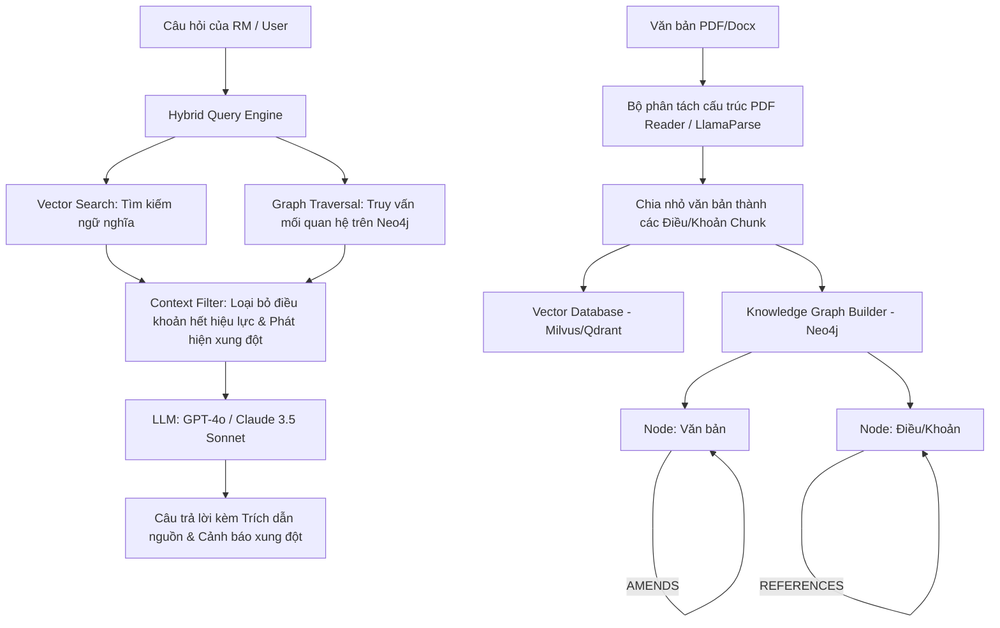

# KẾ HOẠCH PHÁT TRIỂN DỰ ÁN: ADVANCED RAG KNOWLEDGE BASE FOR SHB

Tài liệu này trình bày kế hoạch phát triển chi tiết, kiến trúc kỹ thuật và giải pháp công nghệ cho bài toán **"Advanced RAG Knowledge Base – AI Chatbot for Complex Banking Document Retrieval"** do Ngân hàng SHB đặt đề bài tại VAIC 2026.

---

## 1. PHÂN TÍCH YÊU CẦU & BÀI TOÁN THỰC TẾ CỦA SHB

### 1.1. Bối cảnh
SHB quản lý hàng ngàn văn bản pháp quy nội bộ và bên ngoài (Luật của Chính phủ, Thông tư Ngân hàng Nhà nước, quy trình vận hành nội bộ, biểu mẫu hợp đồng).
* **Khó khăn**: Các văn bản này liên tục sửa đổi, bổ sung theo thời gian. Một thông tư gốc có thể có nhiều quyết định/thông tư sửa đổi bổ sung điều khoản (amendments), trong đó có những điều khoản bị hết hiệu lực một phần (partial supersession).
* **Điểm yếu của RAG truyền thống (Naive RAG)**: Chỉ tìm kiếm tương đồng ngữ nghĩa bằng Vector Search -> Dễ truy xuất nhầm các điều khoản đã hết hiệu lực, dẫn đến câu trả lời sai lệch pháp lý, gây rủi ro tuân thủ (compliance risks) nghiêm trọng cho ngân hàng.

### 1.2. Bốn tính năng cốt lõi bắt buộc phải giải quyết
1. **Cross-references (Tham chiếu chéo)**: Tự động phát hiện, đi theo liên kết và tổng hợp thông tin giữa các văn bản có mối liên hệ với nhau (ví dụ: Quy trình A dẫn chiếu đến Quy định B).
2. **Amendments (Sửa đổi bổ sung)**: Nhận diện phiên bản sửa đổi mới nhất của một điều khoản và tự động áp dụng nội dung mới nhất.
3. **Partial supersession (Hết hiệu lực một phần)**: Đánh dấu và loại trừ hoàn toàn các điều khoản/điều luật đã bị thay thế hoặc hủy bỏ ra khỏi câu trả lời của AI.
4. **Conflicting regulations (Xung đột pháp quy)**: Tự động phát hiện các quy định mâu thuẫn nhau trong hệ thống (ví dụ: Quy chế nội bộ cũ chưa cập nhật khớp với thông tư mới của NHNN) và cảnh báo cho người dùng.

---

## 2. KIẾN TRÚC KỸ THUẬT HỆ THỐNG (AI-NATIVE ARCHITECTURE)

Để giải quyết triệt để mối quan hệ phức tạp giữa các văn bản, hệ thống sẽ kết hợp giữa **Vector Database** (cho tìm kiếm ngữ nghĩa) và **Knowledge Graph (Đồ thị tri thức)** bằng công nghệ **Graph RAG**.

### 2.1. Thiết kế Đồ thị Tri thức (Knowledge Graph Schema trên Neo4j)
* **Các loại Node**:
  * `Document`: Đại diện cho một văn bản (ví dụ: Thông tư 39/2016/TT-NHNN). Thuộc tính: `id`, `title`, `effective_date`, `type` (NHNN/Nội bộ/Chính phủ).
  * `Clause`: Đại diện cho một Điều/Khoản cụ thể trong văn bản. Thuộc tính: `id`, `text`, `version`, `effective_date`, `status` (`Active` / `Superseded`).
* **Các loại Cạnh (Relationship)**:
  * `(Document)-[:HAS_CLAUSE]->(Clause)`: Phân rã cấu trúc văn bản.
  * `(Clause)-[:REFERENCES]->(Clause)`: Mối quan hệ tham chiếu chéo (Cross-references).
  * `(Clause)-[:SUPERSEDES {scope: "partial/full"}]->(Clause)`: Mối quan hệ thay thế (Supersession).
  * `(Document)-[:AMENDS]->(Document)`: Mối quan hệ sửa đổi văn bản (Amendments).

---

## 3. QUY TRÌNH XỬ LÝ DỮ LIỆU & TRUY VẤN (PIPELINE)

### 3.1. Ingestion Pipeline (Quy trình nạp văn bản)
1. **Parsing (Phân tách cấu trúc)**: Sử dụng các mô hình OCR tiên tiến (hoặc LlamaParse) để đọc văn bản PDF của ngân hàng, giữ nguyên cấu trúc bảng biểu, phân mục (Điều 1, Khoản 2, Điểm a).
2. **Chunking (Chia nhỏ văn bản)**: Thực hiện chia chunk theo cấu trúc điều khoản pháp lý, không chia theo độ dài ký tự ngẫu nhiên. Mỗi Clause/Điều khoản là một chunk độc lập.
3. **Metadata Extraction (Trích xuất siêu dữ liệu)**: Dùng LLM trích xuất tự động:
   * Ngày có hiệu lực (`effective_date`).
   * Các mã văn bản được dẫn chiếu trong nội dung (để tạo cạnh `REFERENCES`).
   * Các điều khoản bị sửa đổi, thay thế (để tạo cạnh `SUPERSEDES`).
4. **Graph & Vector Synchronization**: Đẩy Vector Embedding của chunk vào Vector DB (Qdrant/Milvus), đồng thời tạo node và quan hệ tương ứng trên Neo4j.

### 3.2. Query Pipeline (Quy trình trả lời câu hỏi)
1. **Bước 1: Retrieval (Truy xuất Hybrid)**:
   * Chạy Vector Search để tìm Top 10 chunks tương đồng ngữ nghĩa nhất với câu hỏi.
   * Truy vấn Neo4j để lấy các node lân cận liên kết qua quan hệ `REFERENCES` (Cross-referencing) và `SUPERSEDES` (Versioning).
2. **Bước 2: Graph Filtering (Lọc đồ thị)**:
   * Kiểm tra thuộc tính `status` và các cạnh `SUPERSEDES`. Nếu một chunk nằm trong danh sách tìm kiếm nhưng có quan hệ bị `SUPERSEDES` bởi một node mới hơn có `status: Active`, **loại bỏ hoàn toàn chunk cũ** khỏi context gửi lên LLM (Partial supersession).
3. **Bước 3: Conflict Detection (Phát hiện xung đột)**:
   * Hệ thống đối chiếu các thuộc tính hiệu lực của các văn bản đang được dùng làm context. Nếu phát hiện quy định nội bộ có nội dung trái ngược hoặc hết hạn so với thông tư NHNN mới nhất, hệ thống sẽ gom thông tin mâu thuẫn này vào danh sách cảnh báo.
4. **Bước 4: Synthesis & Generation (Tổng hợp & Trả lời)**:
   * Gửi context đã lọc sạch kèm danh sách cảnh báo lên LLM (GPT-4o/Claude 3.5).
   * LLM sinh ra phản hồi tiếng Việt chuẩn nghiệp vụ ngân hàng, có trích dẫn rõ ràng (ví dụ: *"Theo Khoản 2 Điều 5 Thông tư 39 (đã được sửa đổi bởi Thông tư 06/2023)..."*).

---

## 4. CHI TIẾT CÔNG NGHỆ (SUGGESTED TECH STACK)

Để phát triển dự án này một cách nhanh chóng và tối ưu hiệu năng trong 48 giờ hackathon, chúng ta sẽ sử dụng các công nghệ sau:

| Tầng công nghệ | Công nghệ lựa chọn | Vai trò trong dự án |
| :--- | :--- | :--- |
| **Frontend UI** | **React / Streamlit** | Giao diện Chatbot cho người dùng/RM tra cứu + Bảng trực quan hóa Đồ thị tri thức (Knowledge Graph Visualization) + Dashboard Admin để upload và cập nhật tài liệu. |
| **Backend API** | **FastAPI (Python)** | Framework nhẹ, tốc độ phản hồi cực nhanh, tích hợp mượt mà với các thư viện Machine Learning và xử lý đồ thị. |
| **Vector Database** | **Qdrant / Milvus** | Lưu trữ và tìm kiếm vector embedding nhanh chóng. |
| **Graph Database** | **Neo4j / NetworkX** | Lưu trữ và thực hiện các câu truy vấn đồ thị phức tạp (Cypher query) để duyệt cây văn bản pháp lý. |
| **Embedding Model**| **multilingual-e5-large** | Mô hình nhúng hỗ trợ tiếng Việt cực tốt, xử lý tốt ngữ nghĩa chuyên ngành ngân hàng. |
| **LLM Orchestration** | **LlamaIndex / LangChain** | Quản lý luồng RAG, tích hợp GraphStore và VectorStore thành một Agent thống nhất. |
| **LLM Engine** | **GPT-4o / Claude 3.5 Sonnet** | Mô hình ngôn ngữ lớn mạnh mẽ nhất hiện tại để phân tích logic, phát hiện mâu thuẫn và soạn thảo phản hồi. |

---

## 5. THIẾT KẾ GIAO DIỆN (UI/UX DELIVERABLES)

Đầu ra của dự án sẽ bao gồm một Web App hoàn chỉnh có các phân hệ giao diện sau:

1. **AI Chatbot Interface (Dành cho RM / Khách hàng)**:
   * Khung chat ngôn ngữ tự nhiên (tiếng Việt).
   * **Source Citation**: Mỗi câu trả lời của chatbot có các tag nguồn (clickable). Khi người dùng click vào, hệ thống sẽ hiển thị chính xác đoạn trích điều khoản pháp lý gốc làm căn cứ.
   * **Conflict Warning Panel**: Nếu phát hiện xung đột quy định, hệ thống sẽ hiển thị một khung cảnh báo màu vàng: *"Cảnh báo: Có sự mâu thuẫn giữa Quy định nội bộ số 12 và Thông tư 06 mới của NHNN về tỷ lệ cho vay..."*
2. **Knowledge Graph Visualization (Trực quan hóa Đồ thị)**:
   * Bản đồ mạng lưới (Network Graph) tương tác hiển thị mối quan hệ giữa các tài liệu. RM có thể nhìn thấy trực quan văn bản sửa đổi bổ sung (AMENDS) hoặc thay thế (SUPERSEDES) như thế nào.
3. **Clause Version Timeline (Trực quan hóa Lịch sử điều khoản)**:
   * Trục thời gian (Timeline) thể hiện các phiên bản của một điều khoản cụ thể qua các năm (ví dụ: Điều 3 từ năm 2016 -> sửa đổi năm 2020 -> sửa đổi năm 2023).
4. **Admin Document Update Dashboard (Dành cho ban Kiểm soát tuân thủ)**:
   * Giao diện kéo thả file PDF văn bản mới.
   * Hệ thống tự động phân tích và đề xuất liên kết đồ thị: *"Hệ thống phát hiện tài liệu này thay thế một phần Điều 4 của Quyết định 102. Bạn có đồng ý cập nhật liên kết đồ thị không?"*

---

## 6. KẾ HOẠCH PHÁT TRIỂN & PHÂN BỔ CÔNG VIỆC TRONG HACKATHON

Chúng ta sẽ bứt tốc phát triển sản phẩm trong 48 giờ dựa trên sự phối hợp chặt chẽ giữa 3 thành viên:

* **Minh (Backend & Advanced RAG)**:
  * Cài đặt môi trường Neo4j và Qdrant.
  * Viết script parse PDF và trích xuất Metadata liên kết tài liệu.
  * Xây dựng Hybrid Search Engine kết hợp kết quả Vector Search + Cypher Query (Neo4j).
* **Duy (Frontend & Graph Visualization)**:
  * Xây dựng giao diện Web app bằng React/Streamlit.
  * Tích hợp thư viện đồ thị trực quan (như `react-flow` hoặc `D3.js` / Pyvis) để vẽ sơ đồ liên kết văn bản.
  * Hoàn thiện UX hiển thị nguồn trích dẫn và panel cảnh báo xung đột.
* **Trung (Nghiệp vụ & Benchmark)**:
  * Soạn thảo và chuẩn bị bộ dữ liệu mẫu (ví dụ: các thông tư tín dụng NHNN và quy định cho vay nội bộ của SHB có mâu thuẫn/sửa đổi lẫn nhau).
  * Viết tài liệu đánh giá so sánh hiệu năng (Benchmark comparison) giữa hệ thống Advanced RAG (Neo4j) của chúng ta so với hệ thống RAG truyền thống để làm slide chứng minh hiệu quả vượt trội cho Ban Giám khảo.
