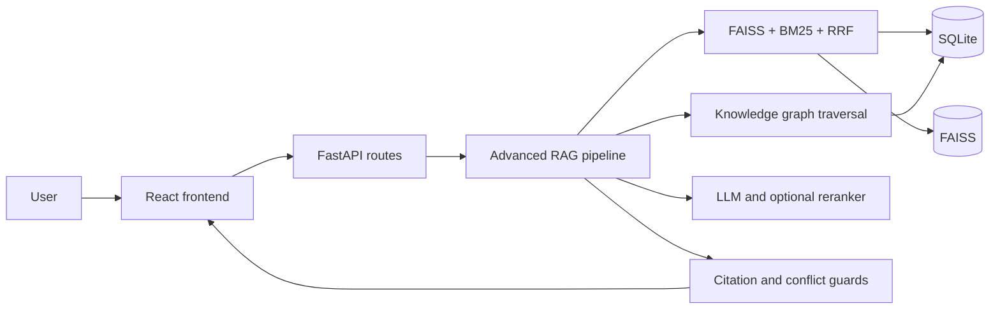

# System architecture

SHB Legal Intelligence is organized as a small backend/frontend monorepo. The backend owns retrieval, legal relationships, ingestion and HTTP APIs. The frontend is grouped by product feature. Runtime data is isolated under `database/`.

## Request flow

## Backend boundaries

- `app/api`: HTTP transport, validation schemas and SSE streaming.
- `app/rag`: retrieval, orchestration, citations, conflicts and graph logic.
- `app/services`: document administration, ingestion and evaluation use cases.
- `app/integrations`: LLM, embedding and reranker clients.
- `app/core`: project configuration and all runtime storage paths.
- `indexing`: Markdown parsing and SQLite/FAISS rebuilding.

All runtime storage paths are defined in `backend/app/core/paths.py`. Feature modules should not derive the repository root independently.

## Frontend boundaries

- `app`: application shell and top-level composition.
- `features/chat`: conversation, SSE state and evidence sidebar.
- `features/documents`: document administration.
- `features/knowledge-graph`: graph, amendment timeline and conflicts.
- `features/benchmark`: retrieval evaluation UI.
- `shared`: reusable components, utilities and global styles.

## Runtime data

- `database/documents/seed`: the 11 active Markdown source documents.
- `database/indexes/data.db`: legal metadata, chunks and relationships.
- `database/indexes/faiss.index`: vector index aligned with SQLite identifiers.

Historical backups and the removed Standard RAG vector store are not part of the active application. Ingestion creates a temporary artifact backup and restores it automatically if rebuilding fails.
