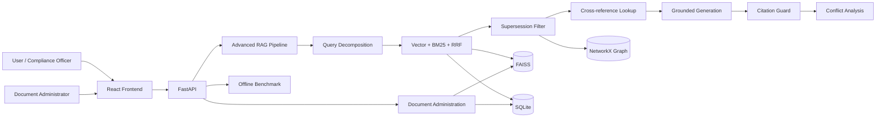

# SHB Legal Intelligence

Advanced Graph-RAG knowledge base for Vietnamese banking regulations and internal compliance documents.

The application answers natural-language questions with verifiable clause-level citations, follows cross-document references, excludes superseded provisions, visualizes legal relationships, detects potential conflicts, and provides a lightweight document administration workflow.

> This repository is a checkpoint-ready prototype. It demonstrates the core legal knowledge and retrieval workflow; it is not a substitute for professional legal review.

## Problem being solved

Banking regulations are not a collection of independent static files. A new circular or internal procedure can:

- reference clauses in another document;
- amend an existing provision;
- replace only one article or clause;
- enter into force after its publication date;
- conflict with an internal banking policy.

Conventional vector-only RAG may retrieve semantically similar but outdated text. SHB Legal Intelligence combines semantic, lexical and relational retrieval with effective-version filtering so that answers are grounded in the appropriate sources.

The implementation follows the requirements described in:

- [`docs/problem-statement.md`](./docs/problem-statement.md)
- [`docs/problem-analysis.md`](./docs/problem-analysis.md)
- [`docs/architecture.md`](./docs/architecture.md)

## Current capabilities

### Advanced compliance chat

- Natural-language Vietnamese questions.
- Model selection before the first question, locked for each conversation.
- Query decomposition for complex requests.
- Streaming Server-Sent Events (SSE).
- Hybrid retrieval using FAISS vector search, BM25 and Reciprocal Rank Fusion.
- Optional reranking.
- Exact document/article lookup for cross-references.
- Superseded-clause filtering before context construction.
- Clause-level citations with document number, status and effective date.
- Citation validation before the final response.
- Sanitized Markdown rendering in the browser.

### Legal knowledge graph

- NetworkX directed graph.
- Document, article and clause nodes.
- `contains`, `references` and `supersedes` relationships.
- Query-specific evidence subgraphs.
- A bundled eKYC 2023 → 2024 amendment demonstration.
- Node detail, effective-status timeline and old/new clause comparison.

### Conflict analysis

- Compares external regulations with SHB internal policies when both are present in retrieved evidence.
- Returns severity, description, both relevant clauses and a suggested resolution.
- Distinguishes these states:
  - conflict detected;
  - no conflict found in retrieved evidence;
  - insufficient evidence;
  - analysis failed.

### Document administration

- Repository statistics.
- Paginated document list: six documents are loaded initially.
- Server-side document search.
- Lightweight document detail: twelve clause records are loaded at a time.
- Full clause content is loaded only after the clause is selected.
- Safe Markdown upload with:
  - filename and content validation;
  - a single-ingestion lock;
  - artifact backup;
  - rollback on failure;
  - automatic in-memory pipeline refresh after success.

### Evaluation

- Deterministic offline benchmark with ten fixed queries.
- Compares keyword baseline retrieval against retrieval with supersession filtering.
- Reports Hit@5 and the number of superseded results returned.
- Does not call an external LLM.

The benchmark intentionally measures retrieval behavior only. Answer correctness and faithfulness require a separately reviewed gold dataset.

## Bundled seed data

The repository currently includes the original indexed dataset:

* **Documents**: 11
* **Chunks**: 1,281
* **Cross-references**: 56
* **Supersession relations**: 1

Documents cover selected Vietnamese laws, State Bank circulars, SHB lending policy and SHB eKYC procedures.

## Architecture



## Query flow

```text
Question
  → decompose into focused subqueries
  → embed each subquery
  → retrieve vector and BM25 candidates
  → fuse candidates with RRF
  → remove superseded clauses
  → optionally rerank
  → follow exact document/article references when required
  → generate a grounded answer
  → validate citations and source status
  → analyze potential regulatory conflicts
  → stream answer, citations, conflict state and evidence graph
```

## Repository structure

```text
.
├── backend/
│   ├── app/
│   │   ├── api/
│   │   │   ├── routes/               # Chat, graph, documents, evaluation, health
│   │   │   └── schemas/              # Pydantic request schemas
│   │   ├── core/                     # Configuration and storage paths
│   │   ├── integrations/             # LLM, embedding and reranker clients
│   │   ├── rag/                      # Retrieval, graph, citations and conflicts
│   │   ├── services/                 # Documents, ingestion and benchmark
│   │   └── main.py                   # FastAPI application factory/lifespan
│   ├── indexing/
│   │   └── build_index.py            # Markdown → SQLite + FAISS
│   ├── main.py
│   ├── requirements.txt
│   └── run_server.sh
├── database/
│   ├── documents/
│   │   └── seed/                     # 11 active Markdown documents
│   └── indexes/
│       ├── data.db                   # Legal metadata and relationships
│       └── faiss.index               # Advanced retrieval vector index
├── frontend/
│   ├── src/
│   │   ├── app/                      # Application shell
│   │   ├── features/                 # Chat, documents, graph and benchmark
│   │   ├── shared/                   # Shared UI, styles and utilities
│   │   └── main.jsx
│   ├── public/
│   ├── package.json
│   └── vite.config.js
├── docs/
│   ├── README.md
│   ├── hackathon_guide.md
│   ├── hackathon.tar.gz
│   ├── system/
│   └── technical/
├── .env.example
└── README.md
```

## Storage model

SQLite is the source of truth for legal metadata used by the application.

### `documents`

Stores document identity and effective status:

- `doc_id`
- `doc_num`
- `title`
- `effective_date`
- `expiration_date`
- `status`

### `chunks`

Stores article/clause content and its FAISS identifier:

- `chunk_id`
- `doc_id`
- `article`
- `clause`
- `embed_text`
- `faiss_index`

### `references_relations`

Links a source clause to a referenced document.

### `supersedes_relations`

Links a newer source clause to a replaced document/article/clause scope.

FAISS is a derived artifact and can be rebuilt from active raw documents. NetworkX graphs are built from SQLite at runtime.

## Requirements

- Python 3.10 or newer.
- Node.js 20.19+ recommended for the current Vite toolchain.
- npm.
- LLM and embedding endpoints compatible with the OpenAI Python client.
- Approximately 1 GB free memory for local indexing and graph visualization.

## Environment configuration

Copy `.env.example` to `backend/.env`. Never commit real credentials.

```bash
cp .env.example backend/.env
```

```dotenv
# Chat completion
CHAT_MODEL_NAME=Llama-3.3-70B-Instruct
CHAT_BASE_URL=https://your-provider.example/v1
CHAT_API_KEY=replace-me

# Embeddings (the bundled FAISS index uses 1024-dimensional vectors)
EMBEDDING_MODEL_NAME=multilingual-e5-large
EMBEDDING_BASE_URL=https://your-provider.example/v1
EMBEDDING_API_KEY=replace-me

# Optional reranker; leave empty to preserve fused retrieval order
RERANKER_MODEL_NAME=
RERANKER_BASE_URL=
RERANKER_API_KEY=

# Optional model keep-alive; disabled by default to avoid quota usage
ENABLE_MODEL_WARMUP=false
MODEL_WARMUP_INTERVAL_SECONDS=240
```

Optional provider-specific variables supported by `ChatService` include `GROQ_API_KEY`, `OPENAI_API_KEY`, `FPT_API_KEY` and `OLLAMA_BASE_URL`. Configure the corresponding comma-separated `GROQ_CHAT_MODELS`, `OPENAI_CHAT_MODELS`, `FPT_CHAT_MODELS` or `OLLAMA_CHAT_MODELS` variable to control the choices exposed by `/models`; providers without credentials are hidden from the frontend.

## Local installation

### 1. Install backend dependencies

```bash
cd backend
python3 -m pip install -r requirements.txt
```

### 2. Install frontend dependencies

```bash
cd frontend
npm ci
```

### 3. Build the production frontend

FastAPI serves `frontend/dist`, so build before starting the server:

```bash
cd frontend
npm run build
```

### 4. Start the application

```bash
cd backend
./run_server.sh
```

Open:

```text
http://localhost:8000
```

The backend uses the `PORT` environment variable when provided and defaults to port `8000`.

## Development frontend

For Vite hot reload:

```bash
cd frontend
npm run dev
```

API requests use relative paths. Configure a Vite proxy if the frontend development server and FastAPI run on different origins.

## Rebuilding the active index

Only active source documents under `database/documents/seed/` are indexed.

```bash
cd backend
python3 indexing/build_index.py
```

The command:

1. parses Markdown documents;
2. extracts document/article/clause metadata;
3. extracts supported references and supersession patterns;
4. rebuilds SQLite;
5. requests embeddings;
6. rebuilds FAISS.

This operation requires a working embedding endpoint. Prefer the Admin workflow for interactive updates because it provides validation, a lock, backup and rollback.

## API reference

### Product

* `GET /`: Production React application
* `GET /health`: Service health
* `GET /models`: Configured chat models safe to expose in the UI
* `POST /chat`: Advanced RAG, streaming or JSON
* `GET /graph`: Full or document-filtered graph

### Administration

* `GET /admin/stats`: Repository counts
* `GET /admin/documents`: Paginated/searchable document list
* `GET /admin/documents/{doc_id}`: Lightweight document and paginated clauses
* `GET /admin/chunks/{chunk_id}`: Full content for one selected clause
* `POST /admin/documents`: Validate, index and activate a Markdown document

Useful document query parameters:

```text
GET /admin/documents?limit=6&offset=0&q=eKYC
GET /admin/documents/10?chunk_limit=12&chunk_offset=0
```

### Evaluation

* `GET /evaluation/benchmark`: Run deterministic offline retrieval evaluation

The product exposes only the Advanced RAG pipeline. The evaluation endpoint computes its keyword baseline offline and does not depend on the removed Standard RAG implementation.

## Chat request examples

### Streaming

```bash
curl -N http://localhost:8000/chat \
  -H 'Content-Type: application/json' \
  -d '{
    "messages": [
      {"role": "user", "content": "Hạn mức giao dịch eKYC một tháng là bao nhiêu?"}
    ],
    "stream": true
  }'
```

### Non-streaming

```bash
curl http://localhost:8000/chat \
  -H 'Content-Type: application/json' \
  -d '{
    "messages": [
      {"role": "user", "content": "Quy trình eKYC 2024 thay thế quy định nào?"}
    ],
    "stream": false
  }'
```

## Verification & Frontend Build

To build the static production assets for the frontend:

```bash
cd frontend
npm run build
```

Frontend checks can also be run separately:

```bash
cd frontend
npm run lint
npm audit --omit=dev
```

The automated tests do not call an external LLM or embedding endpoint.

## Recommended demo flow

1. Open **Hỏi đáp** and choose one of the four sample questions.
2. Inspect the processing trace and effective source citations.
3. Open a citation to view its status and effective date.
4. Open **Đồ thị** to inspect the evidence graph or bundled eKYC amendment graph.
5. Open **Tuân thủ** to review conflict-analysis status.
6. Open **Tài liệu**, select a document and then select an individual clause.
7. Open **Đánh giá** to compare baseline retrieval with supersession filtering.

## Security and production notes

Before a public or banking deployment:

- protect all administration endpoints with authentication and authorization;
- store API keys in the deployment secret manager;
- add rate limits and upload quotas;
- run behind HTTPS;
- restrict CORS and trusted hosts;
- add malware scanning for uploaded files;
- persist ingestion jobs in a queue rather than a single web worker;
- add audit logging and reviewer approval for extracted legal relationships;
- deploy models and embeddings in an approved on-premise or private environment when required;
- validate legal answers with domain experts.

The frontend sanitizes rendered LLM Markdown with DOMPurify, but backend access controls are still required for a public deployment.

## Known prototype limitations

- Active ingestion accepts Markdown only; PDF/DOCX/OCR are future extensions.
- Supersession extraction currently supports a constrained set of Vietnamese legal patterns.
- Temporal filtering focuses on known status and supersession relations rather than arbitrary historical `as-of` queries.
- Conflict detection is LLM-assisted and should be reviewed by a compliance specialist.
- The bundled benchmark measures retrieval, not end-to-end legal correctness.
- NetworkX is appropriate for the prototype dataset; a production-scale graph database may be preferable for much larger repositories.

## License and data

Add the project license and the permitted usage terms for bundled regulatory/internal documents before public distribution. Do not publish confidential banking documents or credentials in a public repository.
